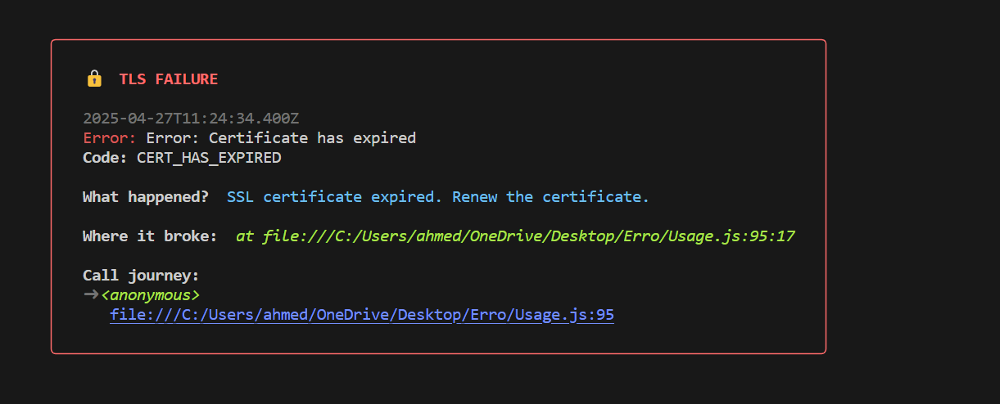

# Debuget


A pocket‑sized debugging dino that pecks away at every error and shows you exactly what went wrong and where—no more hunting through messy stack traces.

---

## 🔥 Features

- **Pretty & Informative**: Colored, boxed output with optional emojis
- **Configurable**: Turn off colors or emojis; set stack‑trace depth; show/hide full stack
- **Express‑ready**: Built‑in middleware to catch and format route errors
- **Process‑safe**: Automatically handles uncaught exceptions & unhandled promise rejections
- **Lightweight**: Zero runtime dependencies beyond `chalk`, `boxen`, and `stacktrace-js`

---

## 🚀 Installation

```bash
npm install debuget
```

or with Yarn:

```bash
yarn add debuget
```

---

## 📦 Usage

### 1) Manual Logging

```js
import { log } from "debuget";

try {
  JSON.parse("not valid JSON");
} catch (err) {
  await log(err);
}
```

### 2) Configure the Theme

```js
import { setConfig } from "debuget";

// Set stack trace depth, disable emojis, change colors, etc.
setConfig({
  stackDepth: 5,
  showStack: false,
  colors: true,
  emoji: false,
});
```

### 3) Express Error Handler

```js
import express from "express";
import { expressMiddleware } from "debuget";

const app = express();

// ... your routes here ...

// Place _after_ all routes to catch errors:
app.use(expressMiddleware());

app.listen(3000, () => console.log("Server running on port 3000"));
```

### 4) CLI / Demo Script

Create a file `demo.mjs`:

```js
import fs from "fs";
import { log, setConfig } from "debuget";

setConfig({ stackDepth: 3, emoji: true, colors: true });

(async () => {
  try {
    await fs.promises.readFile("no-such-file.txt", "utf8");
  } catch (err) {
    await log(err);
  }
})();
```

Run it:

```bash
node --input-type=module demo.mjs
```

---

## ⚙️ Configuration Options

| Option       | Type    | Default | Description                                                 |
| ------------ | ------- | ------- | ----------------------------------------------------------- |
| `emoji`      | boolean | `true`  | Show or hide emoji headers                                  |
| `colors`     | boolean | `true`  | Enable or disable colored output                            |
| `stackDepth` | number  | `3`     | How many stack frames to display in the call journey        |
| `showStack`  | boolean | `true`  | Show the full raw stack trace in the header (post-metadata) |

Update these at runtime via:

```js
import { setConfig } from "debuget";
setConfig({ colors: false, emoji: false, stackDepth: 10 });
```

---

## 🖼️ Example Console Output




Or view it live in your terminal:

```bash
node --input-type=module demo.mjs
```

---

## 🧪 Testing

We include a comprehensive test harness in `test/test.js`. To run:

```bash
npm install
npm test
```

---

## 🤝 Contributing

1. Fork the repo
2. Create your feature branch: `git checkout -b feat/YourFeature`
3. Commit your changes: `git commit -m 'feat: add new feature'`
4. Push to the branch: `git push origin feat/YourFeature`
5. Open a Pull Request

Please follow conventional commits and update tests/examples if you add functionality.

---

## 📄 License

This project is licensed under the **MIT License**. See [LICENSE](LICENSE) for details.
